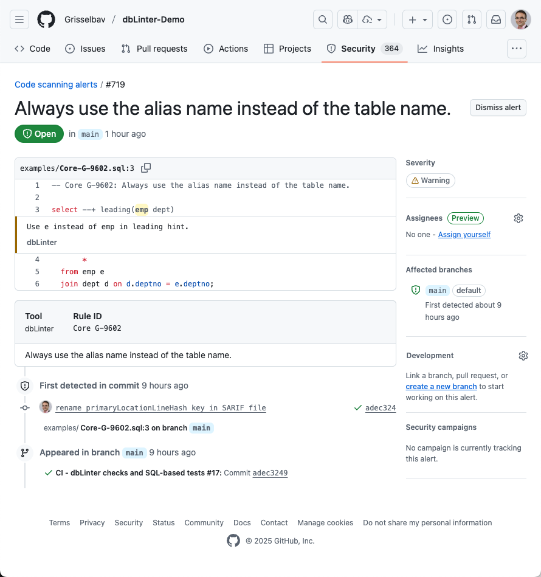
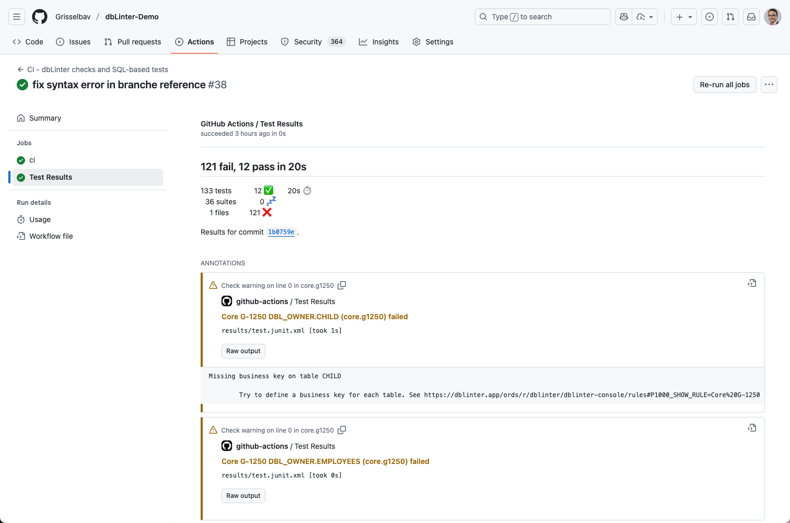
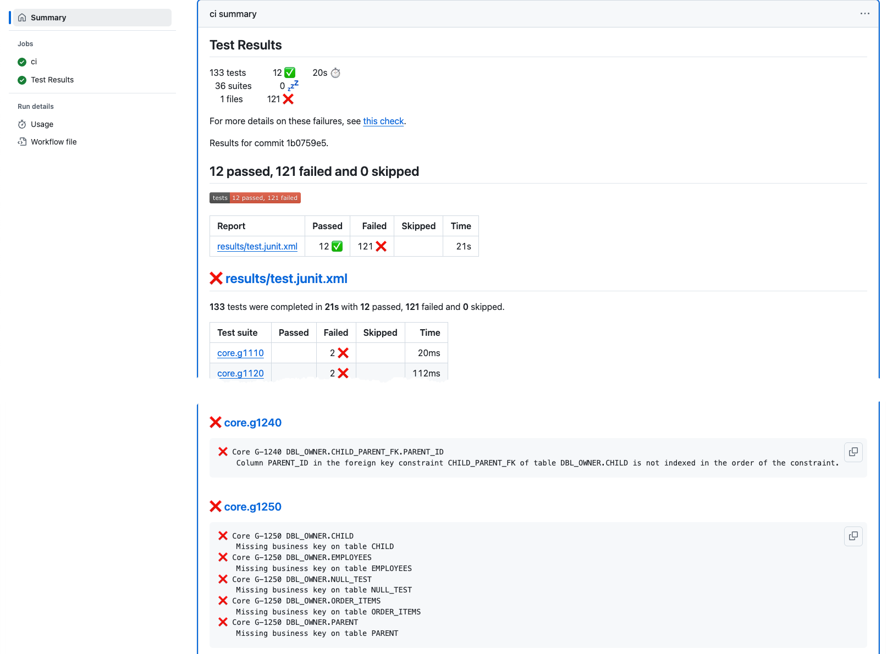

# dbLinter Demo

## Introduction

This repository contains all non-compliant examples from [dbLinter](http://dblinter.app).

The [CI workflow](.github/workflows/ci.yml) uses the [dbLinter CLI](https://grisselbav.github.io/dbLinter/reference/architecture/#cli) to check all SQL files in this repository and the database objects in the Oracle AI Database for compliance
with the dbLinter rules.

The purpose of this repository is to demostrate the use of the dbLinter CLI in a CI/CD environment.

The results are produced using a dbLinter configuration with all rules enabled and default parameters.

## Results

### Installation

The [database installation step](https://github.com/Grisselbav/dbLinter-Demo/blob/main/.github/workflows/ci.yml#L64-L66) produced this [install.log](https://grisselbav.github.io/dbLinter-Demo/install.log) file.

### Check

Raw formats produced by the [CLI](https://github.com/Grisselbav/dbLinter-Demo/blob/main/.github/workflows/ci.yml#L87-L103):

| Name | Description |
| ---- | ----------- |
| [check.log](https://grisselbav.github.io/dbLinter-Demo/check.log) | Trace-level log containing profiles for parsing and checking, which are useful for analysing performance. |
| [check.vscode.md](https://grisselbav.github.io/dbLinter-Demo/check.vscode.md) | dbLinter Check Report as Markdown for VS Code. |
| [check.sonarqube.json](https://grisselbav.github.io/dbLinter-Demo/check.sonarqube.json) | [SonarQube](https://docs.sonarsource.com/sonarqube-server/2025.1/analyzing-source-code/importing-external-issues/generic-issue-import-format/) Generic formatted issue report to import issues in any SonarQube edition without any plugin. |
| [check.sarif.sarif](https://grisselbav.github.io/dbLinter-Demo/check.sarif.sarif) | Static Analysis Results Interchange Format ([SARIF](https://docs.oasis-open.org/sarif/sarif/v2.1.0/errata01/os/sarif-v2.1.0-errata01-os-complete.html)) to visualise issues in various tools. See also [Viewers](https://sarifweb.azurewebsites.net/#Viewers). |
| [check.checkstyle.xml](https://grisselbav.github.io/dbLinter-Demo/check.checkstyle.xml) | [Checkstyle](https://github.com/linkedin/pygradle/blob/master/pygradle-plugin/src/test/resources/checkstyle/checkstyle.xsd) XML report. |
| [check.github.txt](https://grisselbav.github.io/dbLinter-Demo/check.github.txt) | [Workflow commands](https://docs.github.com/en/actions/reference/workflows-and-actions/workflow-commands) for GitHub Actions. These commands (annotations) are interpreted when printed to stdout. |
| [check.gitlab.json](https://grisselbav.github.io/dbLinter-Demo/check.gitlab.json) | [GitLab](https://docs.gitlab.com/ci/testing/code_quality/#code-quality-report-format) quality report. |

The following check results are produced using a previously created input file:

| Result | Producer | Notes |
| ------ | -------- | ----- |
| [Summary Check Report](https://github.com/Grisselbav/dbLinter-Demo/actions/runs/20068004309#user-content-dblinter-check-report) | [Custom Script](https://github.com/Grisselbav/dbLinter-Demo/blob/main/.github/workflows/ci.yml#L211-L216) | The content of check.vscode.md in the summary page of a run. See also the standalone [HTML](https://grisselbav.github.io/dbLinter-Demo/check-report.html) file. |
| [Annotations](https://github.com/Grisselbav/dbLinter-Demo/actions/runs/20068004309#user-content-core-g-9219) | [Custom Script](https://github.com/Grisselbav/dbLinter-Demo/blob/main/.github/workflows/ci.yml#L116-L118) | The result when printing the content of check.github.txt to stdout. |
| [Code Scanning Alerts](https://github.com/Grisselbav/dbLinter-Demo/security/code-scanning/719) | [github/codeql-action/upload-sarif](https://github.com/Grisselbav/dbLinter-Demo/blob/main/.github/workflows/ci.yml#L111-L114) | This action produces code scanning alerts. The alerts are part of the Security tab, which cannot be made visible to the public. See also [About code scanning alerts](https://docs.github.com/en/code-security/code-scanning/managing-code-scanning-alerts/about-code-scanning-alerts) |

Here's a screenshot of a [code scanning alert](https://github.com/Grisselbav/dbLinter-Demo/security/code-scanning/719) shown in the non-public tab of this GitHub repository:

### SQL-based Tests

Raw formats produced by the [CLI](https://github.com/Grisselbav/dbLinter-Demo/blob/main/.github/workflows/ci.yml#L120-L136):

| Name | Description |
| ---- | ----------- |
| [test.log](https://grisselbav.github.io/dbLinter-Demo/test.log) | Trace-level log. |
| [test.vscode.md](https://grisselbav.github.io/dbLinter-Demo/test.vscode.md) | dbLinter Test Report as Markdown for VS Code. This report contains also the executed SQL statements. |
| [test.junit.xml](https://grisselbav.github.io/dbLinter-Demo/test.junit.xml) | [JUnit](https://llg.cubic.org/docs/junit/) XML reporting file. |

The following test results are produced using a previously created input file:

| Result | Producer | Notes |
| ------ | -------- | ----- |
| [Summary Test Report](https://github.com/Grisselbav/dbLinter-Demo/actions/runs/20068004309#user-content-dblinter-test-report) | [Custom Script](https://github.com/Grisselbav/dbLinter-Demo/blob/main/.github/workflows/ci.yml#L218-L223) | The content of test.vscode.md in the summary page of a run. See also the standalone [HTML](https://grisselbav.github.io/dbLinter-Demo/test-report.html) file. |
| [Test Results (EnricoMi)](https://github.com/Grisselbav/dbLinter-Demo/actions/runs/20068004309/job/57562096929) | [EnricoMi/publish-unit-test-result-action](https://github.com/Grisselbav/dbLinter-Demo/blob/main/.github/workflows/ci.yml#L193-L200) | This action produces a own check (job) result. All details of a failure are accessible via a `Raw output` button. |
| [Test Results (dorny)](https://github.com/Grisselbav/dbLinter-Demo/actions/runs/20068004309#summary-57561789364) | [dorny/test-reporter](https://github.com/Grisselbav/dbLinter-Demo/blob/main/.github/workflows/ci.yml#L202-L209) | This action adds a section in the Summary report of the workflow. |

Here's a screenshot of the report produced by the [EnricoMi/publish-unit-test-result-action action](https://github.com/EnricoMi/publish-unit-test-result-action):

Here's a screenshot of the report produced by the [dorny/test-reporter action](https://github.com/dorny/test-reporter):

